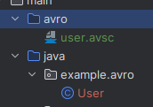

Apache Avro example project in Java.

The project follows the tutorial at https://avro.apache.org/docs/current/getting-started-java/.

## Requirements

* Java 20
* Maven 3.9.3

## Build

```bash
mvn clean package
```

It creates `example.avro.User` class from `src/main/avro/user.avsc` and compiles the project.

